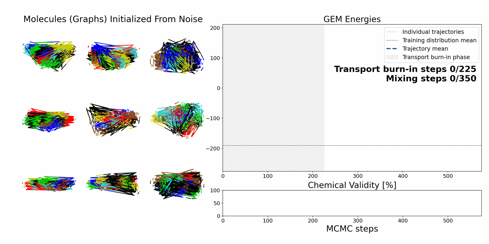

# Graph Energy Matching (GEM)

<p align="center">
  
</p>

Official repository for
[Graph Energy Matching: Transport-Aligned Energy-Based Modeling for Graph Generation](https://michalbalcerak.ai/graph-energy-matching/).

This v0.8 code release focuses on unconditional molecular graph sampling from
the [MOSES](https://doi.org/10.3389/fphar.2020.565644) dataset.

For the continuous-data Energy Matching codebase, including a 2D toy Jupyter
notebook, see [EnergyMatching](https://github.com/m1balcerak/EnergyMatching)
and its [toy example](https://github.com/m1balcerak/EnergyMatching/blob/main/experiments/toy2d/tutorial_2D.ipynb).

## Setup

```bash
conda env create -f environment.yaml
conda activate gem_code
```

## Data (MOSES)

MOSES CSVs are downloaded automatically on first use and cached under
`data/moses/moses_pyg/`.

## Checkpoints

- [MOSES pretrained checkpoint](https://huggingface.co/m1balcerak/GraphEnergyMatching/resolve/main/gem_moses_pretrained_it400000.pt)
- [MOSES fine-tuned checkpoint](https://huggingface.co/m1balcerak/GraphEnergyMatching/resolve/main/gem_moses_it000500.pt)

The fine-tuned checkpoint obtains **94.03% VUN** and **1.466 FCD**.

## Train Transport Loss

Transport-loss pretraining uses `N=4` GPUs and a batch size of 128 per GPU:

```bash
torchrun --standalone --nproc_per_node=4 \
  src/gem/train_gem_ebm_fm.py \
  --config-name gem_ebm_fm_moses_ver3.yaml \
  general.gpus=4 \
  train.distributed.enabled=true \
  train.max_iters=400000 \
  train.lr=1e-4 \
  train.lambda_cl=0.0 \
  train.cl_steps=0 \
  train.save_every=25000
```

## Tune Mixing Proposal Sampler

Calibration searches `dl_beta_prop`, `dl_beta_mh_init`, `dl_beta_mh_final`,
`dl_lambda_X`, and `dl_lambda_E`. The MOSES values are provided in the phase-2
command below. Recalibrate only for a different transport checkpoint or dataset:

```bash
python src/gem/cali_params.py \
  --config-name cali_params_moses.yaml \
  train.resume=/path/to/transport/checkpoint.pt
```

## Fine-Tune Transport + Contrastive

Fine-tuning also uses `N=4` GPUs and a batch size of 128 per GPU:

```bash
torchrun --standalone --nproc_per_node=4 \
  src/gem/train_gem_ebm_fm.py \
  --config-name gem_ebm_fm_moses_ver3.yaml \
  general.gpus=4 \
  train.distributed.enabled=true \
  train.init_ckpt=/path/to/transport/checkpoint.pt
```

## Evaluate FCD And Metrics

By default, FCD uses the complete unfiltered internal validation split (the
official MOSES `test_scaffolds.csv`). The evaluator writes JSON/CSV metrics and
generated SMILES:

```bash
python src/gem/metrics_over_time.py \
  --config-name gem_metrics_over_time_moses.yaml \
  metrics_run.checkpoint=/path/to/model.pt \
  metrics_run.batch_size=512
```

## MOSES unconditional animation

```bash
python src/gem/animate_energy.py \
  --config-name gem_ebm_animation_moses_public.yaml \
  viz.checkpoint=/path/to/model.pt
```

## Citation

If you use this code, please cite the Graph Energy Matching paper.

Parts of the graph transformer, MOSES data processing, molecular metrics, and
discrete flow-matching utilities are adapted from DeFoG (Qin et al., 2025).

```bibtex
@article{balcerak2026graphenergymatching,
  title={Graph Energy Matching: Transport-Aligned Energy-Based Modeling for Graph Generation},
  author={Balcerak, Michal and Shit, Suprosanna and Prabhakar, Chinmay and Kaltenbach, Sebastian and Albergo, Michael S. and Du, Yilun and Menze, Bjoern},
  journal={arXiv preprint arXiv:2603.23398},
  year={2026}
}
```
